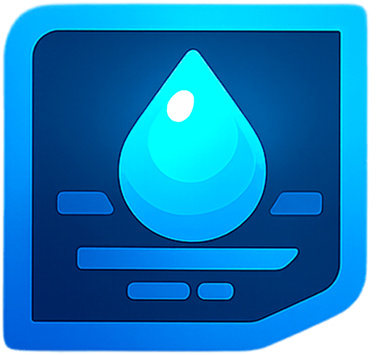
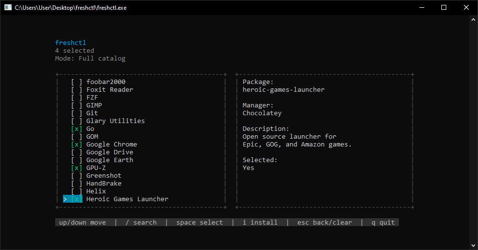

<h1 align="center">
  
  freshctl
</h1>

<p align="center">
	<span style="font-size: 30px; font-weight: 300;">
  windows bootstrap utility
  </span>
</p>

<p align="center">
	<span style="font-size: 22px; font-weight: 300;">
  install apps from a clean terminal interface.
  </span>
</p>

<p align="center">
  
  
  
</p>

## Install

PowerShell:

```powershell
irm https://freshctl.tech/install.ps1 | iex
```

Options:

```powershell
# install without launching freshctl afterwards
.\install.ps1 -NoLaunch

# install without prompts
.\install.ps1 -Silent
```

---

## Screenshot




---

## Features

- full catalog search
- category browser
- chocolatey bootstrap
- package selection
- terminal-native tui
- fast setup for fresh Windows installs
- clean minimal interface

---

## Build

```powershell
go mod tidy
go build -o freshctl.exe .
```

---

## Run

```powershell
.\freshctl.exe
```

---

## Uninstall

Use the installer uninstall mode from an elevated PowerShell:

```powershell
iwr https://freshctl.tech/install.ps1 -OutFile "$env:TEMP\freshctl-install.ps1"
powershell -ExecutionPolicy Bypass -File "$env:TEMP\freshctl-install.ps1" -Uninstall
```

This removes:

- `C:\Program Files\freshctl\`
- the freshctl PATH entry
- the Start Menu shortcut
- temporary installer files

It does **not** remove Chocolatey or apps installed through Chocolatey. freshctl uses Chocolatey as the package manager, but it does not own the Chocolatey installation.

To remove Chocolatey too, follow Chocolatey's uninstall guidance: remove `C:\ProgramData\chocolatey` and Chocolatey's environment variables/PATH entries. Be careful: this removes Chocolatey's package state and cache, not the normal Windows apps already installed by package installers.

freshctl currently does not keep a separate config directory. Runtime installer files are temporary and live under:

```text
%TEMP%\freshctl-installer
```

---

## Requirements

- Windows 10/11
- PowerShell
- Administrator privileges may be required
- Internet connection

---

## Package Source

freshctl currently uses Chocolatey as its install backend.

Package managers are implementation details, not the product identity. The goal is simple: download freshctl, open it, choose apps, and install them quietly with clear status and reliable results.

---

## Project Direction

freshctl prioritizes reliability over catalog size. Packages in the default catalog should be verified, suitable for unattended install, and useful on modern Windows 10/11 systems.

Broken, deprecated, interactive, hardware-dependent, or VM-hostile packages should not be shown by default. A smaller verified catalog is better than a large catalog full of unreliable installs.

Future work is focused on a better Windows setup experience: direct installers where they are more reliable, installed-app detection, clearer UX, proxy and network handling, presets, profiles, and safe Windows setup tweaks.

---

## Windows Sandbox Testing

For clean-system testing, use Windows Sandbox on Windows Pro/Enterprise/Education.

1. Enable Windows Sandbox in Windows Features.
2. Open `sandbox\freshctl.wsb`.
3. In the Sandbox PowerShell window, run:

```powershell
irm https://freshctl.tech/install.ps1 | iex
```

Recommended checks:

- installer requests elevation cleanly
- latest GitHub release is detected
- `freshctl.exe` installs to `C:\Program Files\freshctl\`
- `freshctl` is available in a new terminal via PATH
- Start Menu shortcut exists
- uninstall mode removes freshctl cleanly
- selected packages install successfully on a clean system

Sandbox resets when closed, so it is safe for repeated fresh install tests.

Package ID validation is only the first pass. A Chocolatey package can exist and still fail during install if its package script depends on an upstream URL, checksum, or installer that changed. For release testing, smoke-test representative packages in Windows Sandbox instead of relying only on package ID lookup.

---

## Included Packages

freshctl currently includes packages for:

- browsers
- development tools
- runtimes
- terminals
- media tools
- gaming utilities
- networking
- virtualization
- productivity
- privacy & security

Examples:

- Google Chrome
- Firefox
- VSCode
- Git
- Docker Desktop
- Python
- Node.js
- OBS Studio
- Discord
- Steam
- Tailscale
- PowerToys
- ShareX
- qBittorrent
- VirtualBox

---

## License

MIT License

See [LICENSE](./LICENSE).
